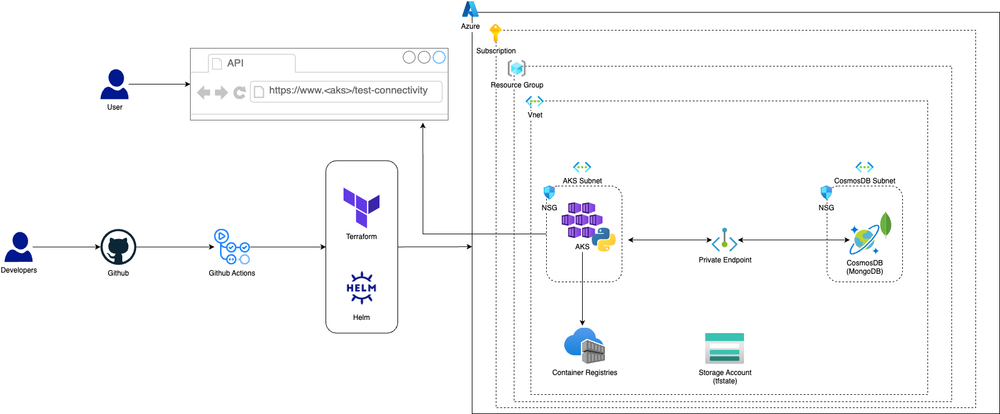

# DevOps automation for Azure
AKS, Terraform, Helm, CI/CD, etc

## Diagram


## Test API

### Test base URL
```curl -k https://<aks_name>.eastus.azmk8s.io/```

### Test CosmosDB
```curl -k https://<aks_name>.eastus.azmk8s.io/test-connectivity```

## Infra Pipeline
https://github.com/kalildevops/aks-template/actions/workflows/infra.yaml

## CI/CD pipeline
https://github.com/kalildevops/aks-template/actions/workflows/cicd.yaml


## Project Prerequisites
### Dependencies
- Install Terraform https://developer.hashicorp.com/terraform/install
- Install Helm https://helm.sh/docs/intro/install/
### Azure
- Azure Subscription
- Resource Group
- SPN
- Storage Account and Container to store tfstate

### SPN IAM permissions
For the Subscription scope, set ```Contributor```for the SPN created

### Github Environments
- dev
- stage
- prod

### Github Secrets
For each Github Environment (dev, stage and prod) set the group of secrets

```
ARM_CLIENT_ID
ARM_CLIENT_SECRET
ARM_SUBSCRIPTION_ID
ARM_TENANT_ID
AZURE_CREDENTIALS
AZURE_CREDENTIALS
KUBECONFIG
MONGODB_CONNECTION_STRING
```
For ```AZURE_CREDENTIALS``` secret, follow the json format below
```
{
    "clientSecret": "",
    "subscriptionId": "",
    "tenantId": "",
    "clientId": ""
}
```
### K8s dependencies

To deal with the ```MONGODB_CONNECTION_STRING``` create k8s namespace ```python-apps``` and k8s secret ```mongodb-connection-secret```

YAML examples:

```
apiVersion: v1
kind: Namespace
metadata:
  name: python-apps
```

```
apiVersion: v1
kind: Secret
metadata:
  name: mongodb-connection-secret
  namespace: python-apps
data:
  mongodb-connection-string: <base64>

```

## Run Terraform locally  

Based in the SPN created, export the values below
```
export ARM_CLIENT_ID=< >
export ARM_CLIENT_SECRET=< > 
export ARM_SUBSCRIPTION_ID=< >
export ARM_TENANT_ID= < >
```
Init, Plan and Apply

```
cd iac/terraform/envs/<env>
terraform init
terraform plan -var-file="<env>.tfvars"
terraform apply
```

## Run Helm locally

Update ```values-dev.yaml``` including ```connection_string: <secret>``` in the end of the file
```
# Secret
secret:
  secretName: mongodb-connection-secret
  connection_string: <secret>
```
cd app/helm/
export MONGODB_CONNECTION_STRING="<secret>"
helm install app --kube-context dev-aks-cluster  -f values-dev.yaml .
```
